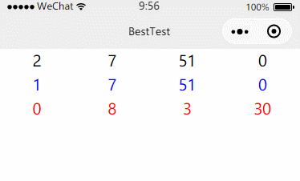

# wxCountdown

简单易用的微信小程序倒计时库

## 使用方法

### 引入

```js
import Countdown from '../../utils/wxCountdown.js'
```

### 初始化

你可以在页面初始化任意数量的倒计时对象。第一个参数是时间，你可以从后台拿数据动态传入；第二个参数是 countDown 的 id，第三个是当前页面对象。三个参数都是必选的。

```js
Countdown.init('2018-5-17 17:47:30','countdown1',this)
Countdown.init('2018-5-16 17:47:30','countdown2',this)
Countdown.init('2018-5-15 18:00:00','countdown3',this)
```

### 页面

UI 部分我本来想写成template，但是那样UI就不灵活了，所以用户可以自行设计UI。

```html
<view class="weui-flex" style="text-align:center">
  <view class="weui-flex__item">{{countdown1.day}}</view>
  <view class="weui-flex__item">{{countdown1.hour}}</view>
	<view class="weui-flex__item">{{countdown1.minute}}</view>
  <view class="weui-flex__item">{{countdown1.seconds}}</view>
</view>
<view class="weui-flex" style="text-align:center;color:blue">
  <view class="weui-flex__item">{{countdown2.day}}</view>
  <view class="weui-flex__item">{{countdown2.hour}}</view>
	<view class="weui-flex__item">{{countdown2.minute}}</view>
  <view class="weui-flex__item">{{countdown2.seconds}}</view>
</view>
<view class="weui-flex" style="text-align:center;color:red">
  <view class="weui-flex__item">{{countdown3.day}}</view>
  <view class="weui-flex__item">{{countdown3.hour}}</view>
	<view class="weui-flex__item">{{countdown3.minute}}</view>
  <view class="weui-flex__item">{{countdown3.seconds}}</view>
</view>
```

## 效果


